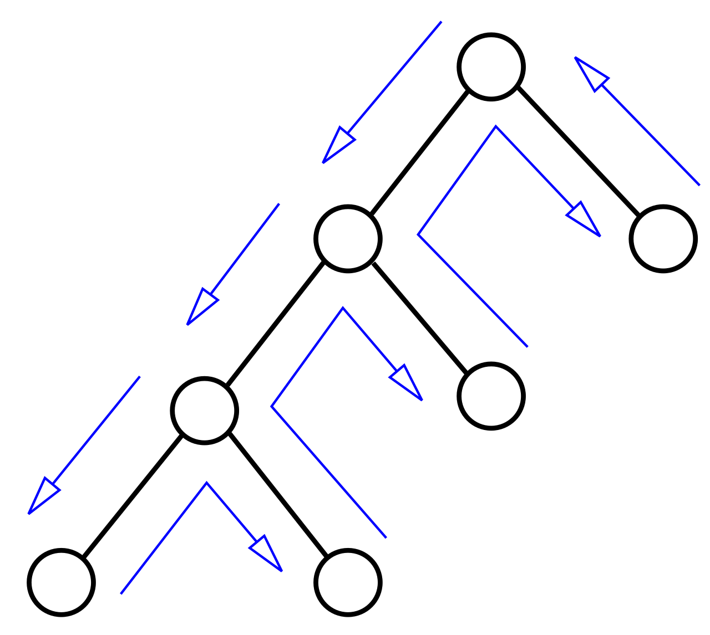
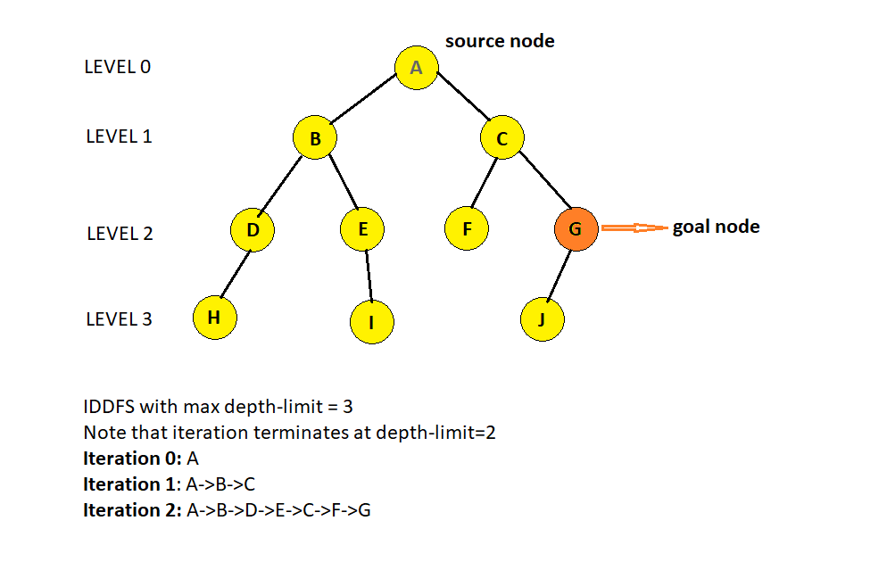
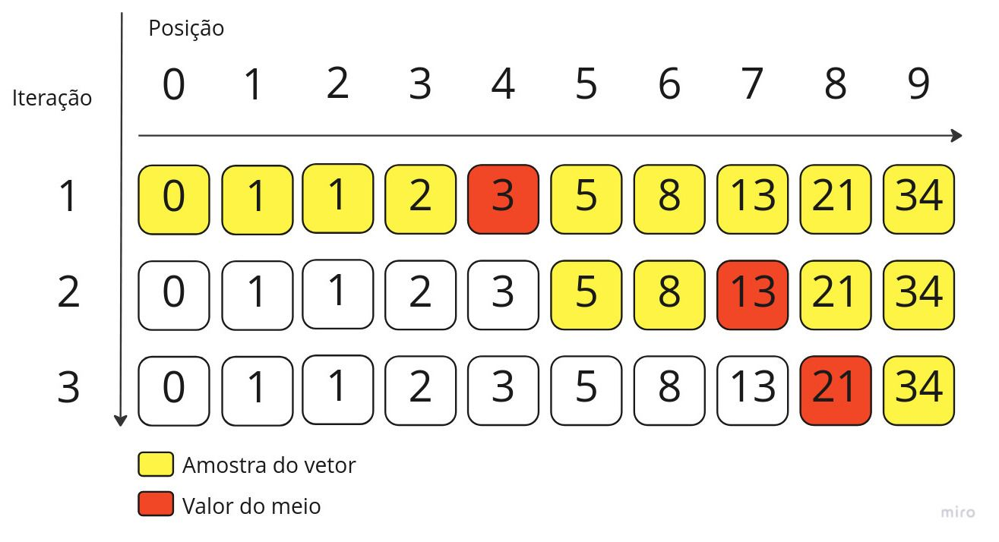

# Técnicas Avançadas de Busca Completa

Esta seção cobre as principais otimizações e variações da Busca Completa usadas em problemas mais difíceis. Em vez de explorar tudo cegamente, cada técnica reduz o espaço de busca de forma inteligente.

---

## Backtracking

O Backtracking é uma Busca Completa com **poda**: ao perceber que um caminho não pode levar a uma solução válida ou melhor, ele **abandona esse ramo imediatamente** e volta (backtrack) para tentar outra opção.

<p align="center">
  
</p>

A estrutura de toda função de backtracking segue o mesmo padrão:

```cpp
void backtrack(estado_atual, ...) {
    if (impossível ou pior que melhor conhecido) return; // PODA

    if (caso_base) {
        // Registra solução
        return;
    }

    for (cada próxima_escolha válida) {
        // 1. Marca estado
        // 2. Chama recursão
        backtrack(próximo_estado, ...);
        // 3. Desmarca estado (backtrack)
    }
}
```

### TSP — Caixeiro Viajante

Encontra o menor caminho que visita todas as cidades e volta à origem.

- **Poda de Otimalidade:** se o custo acumulado já é maior ou igual ao melhor encontrado, abandona o ramo
- **Caso base:** todas as `n` cidades visitadas → computa o custo de retorno

```cpp
// PODA: aborta se já é pior que o melhor conhecido
if (custo_atual >= melhor_custo) return;

// Caso base: visitou tudo, tenta fechar o ciclo
if (visitadas_count == n) {
    melhor_custo = min(melhor_custo, custo_atual + dist[cidade_atual][0]);
    return;
}
```

### N-Rainhas

Posiciona N rainhas em um tabuleiro N×N sem que nenhuma se ataque.

- **Poda de Viabilidade:** vetores booleanos permitem checar ataques em O(1) — coluna, diagonal principal e diagonal secundária
- Ao invés de verificar toda a linha/coluna, marca os vetores ao entrar e desmarca ao sair

```cpp
// Checa ataque em O(1) com vetores de marcação
if (colunas[c] || diag1[linha + c] || diag2[linha - c + n - 1]) continue;

colunas[c] = diag1[linha + c] = diag2[linha - c + n - 1] = true;  // Marca
resolver_n_rainhas(linha + 1, ...);
colunas[c] = diag1[linha + c] = diag2[linha - c + n - 1] = false; // Desmarca
```

---

## IDDFS — Iterative Deepening DFS

O IDDFS combina o **baixo consumo de memória da DFS** com a **garantia de caminho mínimo da BFS**, rodando repetidas DFS com limite de profundidade crescente.

<p align="center">
  
</p>

- A cada iteração, o limite de profundidade aumenta em 1
- Apesar de recalcular nós rasos repetidamente, a complexidade assintótica é **igual à BFS** — os nós mais profundos dominam o custo
- Uso de memória: **O(Profundidade)** — muito melhor que a BFS em grafos largos

```cpp
// DFS com limite: corta o ramo ao atingir a profundidade máxima
bool dfs_limitada(int estado, int prof_atual, int limite) {
    if (estado == objetivo) return true;
    if (prof_atual == limite) return false; // PODA de profundidade

    for (int proximo : gera_vizinhos(estado))
        if (dfs_limitada(proximo, prof_atual + 1, limite)) return true;

    return false;
}

// Loop principal: aumenta o limite até encontrar ou esgotar
for (int limite = 0; limite <= max_prof; limite++)
    if (dfs_limitada(inicio, 0, limite)) return limite;
```

> **Atenção:** se o espaço de estados puder formar ciclos, mantenha um vetor `visitado` e **limpe-o a cada nova iteração** do loop externo.

---

## Meet in the Middle

Divide o problema em **duas metades**, resolve cada uma independentemente e combina os resultados. Transforma O(2ⁿ) em **O(2^(n/2) · log n)** — essencial quando n ≤ 40.

<p align="center">
  
</p>

**Aplicação típica:** verificar se algum subconjunto de um array soma exatamente `alvo`.

```
Força bruta: 2^40 ≈ 1 trilhão de operações  ✗
Meet in the Middle: 2^20 ≈ 1 milhão         ✓
```

```cpp
// 1. Gera todas as somas possíveis de cada metade
vector<long long> soma_esq = get_sums(0, n/2);
vector<long long> soma_dir = get_sums(n/2, n);

// 2. Ordena a metade direita para busca binária
sort(soma_dir.begin(), soma_dir.end());

// 3. Para cada soma da esquerda, procura o complemento na direita
for (long long se : soma_esq) {
    if (binary_search(soma_dir.begin(), soma_dir.end(), alvo - se))
        return true;
}
```

---

## Busca Binária na Resposta

Em vez de buscar a resposta diretamente, aplica Busca Binária sobre o **espaço de possíveis respostas** e verifica cada candidato com uma função `check()` eficiente.

<p align="center">
  
</p>

**Quando usar:** o problema pede um valor ótimo (mínimo ou máximo) e é possível verificar em O(N) se um valor `x` é viável.

```
"Qual a menor capacidade máxima para transportar tudo com K caminhões?"
→ Busca Binária no intervalo [max(pesos), soma(pesos)]
→ Para cada 'mid', simula a distribuição gulosa em O(N)
```

### Estrutura padrão

```cpp
long long esquerda = valor_minimo_possivel;
long long direita  = valor_maximo_possivel;
long long resposta = direita;

while (esquerda <= direita) {
    long long mid = esquerda + (direita - esquerda) / 2;

    if (check(mid)) {
        resposta = mid;   // mid é viável → tenta melhorar
        direita = mid - 1;
    } else {
        esquerda = mid + 1; // mid inviável → precisa aumentar
    }
}
```

### Inversão para "Maximizar o Mínimo"

Se o problema pede para **maximizar o menor valor** (ex: afastar vacas o máximo possível), a lógica inverte:

```cpp
if (check(mid)) { resposta = mid; esquerda = mid + 1; }
else            { direita = mid - 1; }
```

> **Dica:** os limites `esquerda` e `direita` devem ser escolhidos com cuidado. O limite inferior ideal é o maior elemento do array; o superior é a soma de todos.