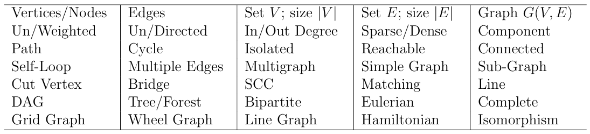

# Grafos (Graphs)

Muitos problemas do mundo real (e de maratonas/competições de programação) podem ser modelados como problemas em grafos. Alguns possuem soluções eficientes (polinomiais), enquanto outros não (problemas NP-difíceis). Este diretório aborda os problemas em grafos que mais aparecem em competições de programação, além de suas implementações.

### Alguns dos tópicos incluem:

- **Travessias básicas (Busca em Profundidade - `DFS` e Busca em Largura - `BFS`).**
- **Árvores Geradoras Mínimas (Minimum Spanning Trees - `MST`).**
- **Caminhos mais curtos de fonte única (Dijkstra, Bellman-Ford) e de todos os pares (Floyd-Warshall).**
- **Propriedades de grafos especiais.**
- **Tópicos avançados (fluxos em redes, emparelhamento, etc).**

### Pré-requisitos:

Assume-se que o leitor já conheça os termos básicos de teoria dos grafos (como `vértice`, `aresta`, `caminho`, `ciclo`, `grau`, `grafo direcionado/não direcionado`, `ponderado/não ponderado`, `denso/esparso`, `árvore`, `grafo bipartido`, etc). Além disso, é necessário saber representar grafos computacionalmente, utilizando `Matriz de Adjacência`, `Lista de Adjacência` ou `Lista de Arestas`.

*Abaixo está uma tabela de conceitos aplicados (em inglês), é fortemente recomendado que você pesquise-os antes de prosseguir*.

  

Quase todo conjunto de problemas em competições / maratonas tem pelo menos um exercício sobre grafos. Dada a vasta quantidade de temas, a única forma de garantir um bom desempenho é **estudar todos eles**. A maioria dos problemas envolve grafos simples (sem loops ou arestas múltiplas entre dois nós).

### Dica de Estudo:

Para entender melhor os algoritmos que serão ensinados, recomenda-se o uso da ferramenta [VisuAlgo](https://visualgo.net/en). Ela permite visualizar a execução passo a passo em grafos customizados.